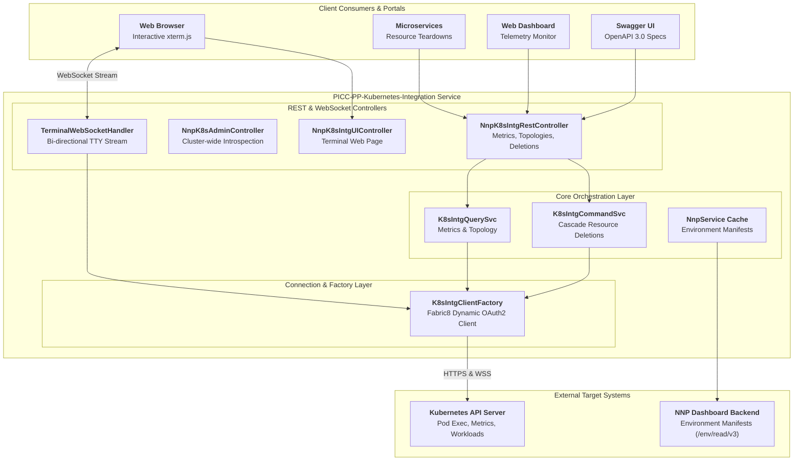

# PICC-PP-Kubernetes-Integration

[](https://openjdk.org/)
[](https://spring.io/projects/spring-boot)
[](https://fabric8.io/)
[](https://spring.io/guides/gs/websockets/)
[](LICENSE)
[](https://github.com/Nubo-Native-Platform/PICC-PP-Kubernetes-Integration/actions)

An enterprise-grade, declarative Kubernetes cluster integration and interactive web terminal microservice built on **Spring Boot 3**, **Fabric8 Kubernetes Client**, **Java 21 Virtual Threads**, and **Spring WebSocket**.

Designed for high-performance pod resource telemetry, multi-tenant environment discovery, automated cascading deployment teardowns, and zero-dependency in-browser pod terminal streaming.

---

## Table of Contents

- [Key Features](#key-features)
- [Architecture & Workflow](#architecture--workflow)
  - [System Architecture](#system-architecture)
  - [Interactive WebSocket Terminal Workflow](#interactive-websocket-terminal-workflow)
- [Configuration Reference](#configuration-reference)
- [Quick Start](#quick-start)
  - [1. One-Click Local Setup with Docker Compose](#1-one-click-local-setup-with-docker-compose)
  - [2. Run Directly with Maven Wrapper](#2-run-directly-with-maven-wrapper)
- [API Documentation & Swagger UI](#api-documentation--swagger-ui)
- [REST API Reference](#rest-api-reference)
- [Security & Compliance](#security--compliance)
- [Documentation Guides](#documentation-guides)
- [License](#license)

---

## Key Features

- **Declarative Cluster Abstraction**: Encapsulates Fabric8 Kubernetes SDK behind type-safe, REST endpoints and WebSocket handlers for seamless platform integration.
- **Bi-Directional Interactive Terminal**: Embeds an HTML5 `xterm.js` web console communicating over WebSockets directly to container PTY devices via `/bin/bash` or `/bin/sh`.
- **Real-Time Resource Telemetry**: Aggregates CPU and memory utilization from `metrics.k8s.io` with automated unit normalization into millicores, nanocores, and megabytes.
- **Deployment Resource Discovery**: Maps complex cluster relationships between deployments, replicasets, pods, services, secrets, configmaps, PVCs, and ingresses.
- **Cascading Lifecycle Teardowns**: Safely orchestrates multi-resource cleanup and environment uninstallation through batch operations.
- **Dynamic Cluster Security Binding**: Injects scoped service account tokens on-demand from the NNP Dashboard cache, avoiding permanent cluster-wide admin exposure.
- **Zero-Crash Standalone Default**: All properties include sensible environment variable overrides with fallback defaults, ensuring immediate out-of-the-box local developer startup.
- **DevSecOps & Supply Chain Hardened**: SpotBugs + FindSecBugs SAST verification (0 defects), OWASP dependency audits, and automated CycloneDX SBOM generation (CNCF compliant).

---

## Architecture & Workflow

### System Architecture




### Interactive WebSocket Terminal Workflow


---

## Configuration Reference

All settings can be supplied via environment variables or properties:

| Variable | Property Key | Default Value | Description |
|----------|--------------|---------------|-------------|
| `PORT` | `server.port` | `8080` | HTTP listening port |
| `SPRING_CLOUD_CONFIG_ENABLED` | `spring.cloud.config.enabled` | `false` | Enable/disable Spring Cloud Config |
| `K8S_URL` | `k8s.url` | `https://kubernetes.default.svc` | Target Kubernetes API Server URL |
| `K8S_MASTER_TOKEN` | `k8s.master.token` | `""` | Cluster admin bearer token for master client |
| `NNP_DASH_BASEURL` | `nnp.dash.baseurl` | `http://localhost:8082` | NNP Dashboard base URL for environment manifests |
| `VAR_BASE_NNP_DOMAIN` | `VAR.BASE.NNP.DOMAIN` | `localhost:8080` | Host / domain for terminal client WebSocket redirect |

---

## Quick Start

### 1. One-Click Local Setup with Docker Compose
```bash
# Clone the repository
git clone https://github.com/Nubo-Native-Platform/PICC-PP-Kubernetes-Integration.git
cd PICC-PP-Kubernetes-Integration

# Copy configuration blueprint
cp .env.example .env

# Build and start container
docker compose up -d --build

# Follow container output
docker compose logs -f
```

### 2. Run Directly with Maven Wrapper
```bash
# Run standalone with JDK 21
./mvnw clean spring-boot:run
```

The application starts on `http://localhost:8080`.

---

## API Documentation & Swagger UI

Interactive Swagger UI documentation is available at:
- **Swagger UI**: [http://localhost:8080/swagger-ui.html](http://localhost:8080/swagger-ui.html)
- **OpenAPI 3.0 Specification**: [http://localhost:8080/v3/api-docs](http://localhost:8080/v3/api-docs)

---

## REST API Reference

| Method | Endpoint | Parameters | Description |
|--------|----------|------------|-------------|
| `GET` | `/pods/details` | `envName` | Live pod metrics (CPU nanocores, Memory MB) |
| `GET` | `/associated/deployment/resources` | `envName`, `deploymentName` | Discovers resources linked to deployment |
| `DELETE` | `/pod` | `envName`, `podName` | Terminates a specific pod |
| `POST` | `/delete/resources` | JSON Body | Cascade deletion of deployments, secrets, services, PVCs |
| `GET` | `/admin/pods` | None | Lists all pods cluster-wide |
| `DELETE` | `/cache/env` | None | Clears cached environment manifests |
| `GET` | `/terminal` | `envName`, `pod`, `container` | Serves interactive web terminal UI |
| `WS` | `/terminal/exec` | `envName`, `pod`, `container` | WebSocket stream for remote shell execution |

---

## Security & Compliance

- **No Hardcoded Credentials**: Strictly zero hardcoded passwords, tokens, or internal IP addresses in source control.
- **SpotBugs SAST**: Automated static analysis configured with FindSecBugs with 0 reported vulnerabilities.
- **CycloneDX SBOM**: Standardized CNCF Software Bill of Materials generated during builds (`target/bom.json`).
- **Container Hardening**: Multi-stage build running on Alpine Linux under an unprivileged `appuser`.

---

## Documentation Guides

- [Development Guidelines & Contribution Standards](DEVELOPMENT_GUIDELINES.md)
- [User Manual & Kubernetes Deployment Guide](USER_MANUAL_AND_DEPLOYMENT_GUIDE.md)
- [Contributing Standards](CONTRIBUTING.md)
- [Code of Conduct](CODE_OF_CONDUCT.md)
- [Security Policy](SECURITY.md)
- [Maintainers Roster](MAINTAINERS.md)

---

## License

This project is licensed under the **Apache License 2.0**. See the [LICENSE](LICENSE) file for details.